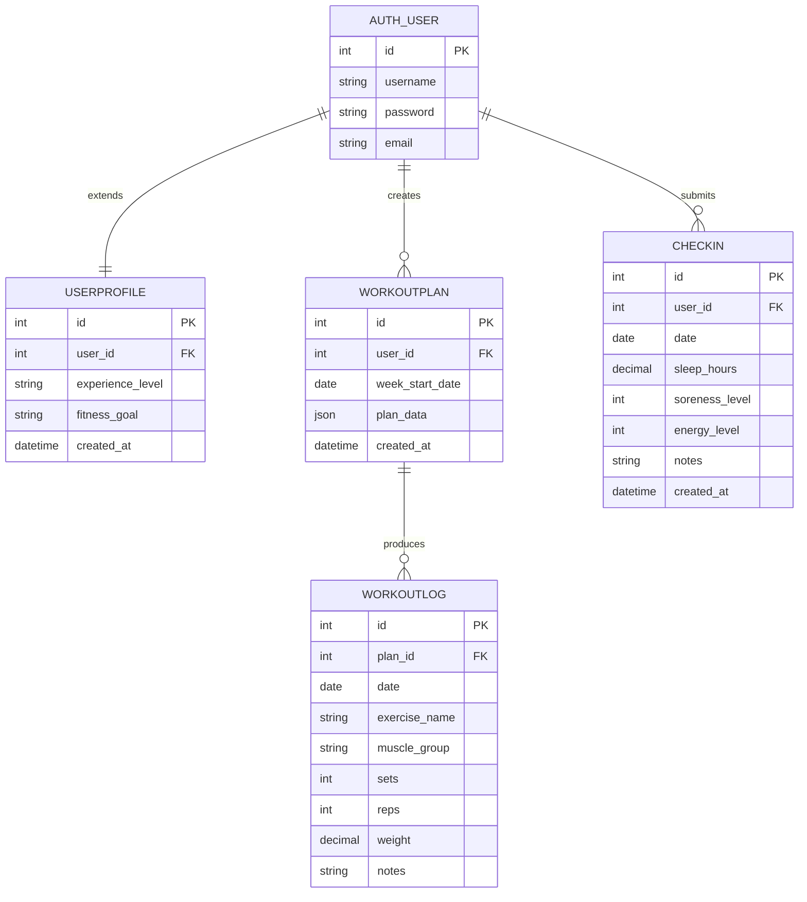

```mermaid
erDiagram
    AUTH_USER ||--|| USERPROFILE : extends
    AUTH_USER ||--o{ WORKOUTPLAN : creates
    WORKOUTPLAN ||--o{ WORKOUTLOG : produces
    AUTH_USER ||--o{ CHECKIN : submits

    AUTH_USER {
        int id PK
        string username
        string password
        string email
    }
    WORKOUTPLAN {
        int id PK
        int user_id FK
        date week_start_date
        json plan_data
        datetime created_at
    }
    WORKOUTLOG {
        int id PK
        int plan_id FK
        date date
        string exercise_name
        string muscle_group
        int sets
        int reps
        decimal weight
        string notes
    }
    CHECKIN {
        int id PK
        int user_id FK
        date date
        decimal sleep_hours
        int soreness_level
        int energy_level
        string notes
        datetime created_at
    }
    USERPROFILE {
        int id PK
        int user_id FK
        string experience_level
        string fitness_goal
        datetime created_at
    }
```
